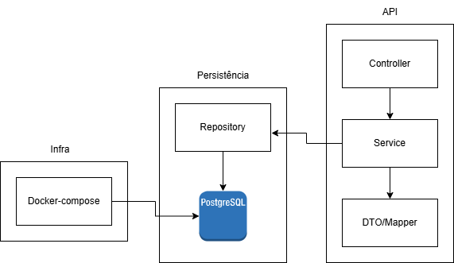
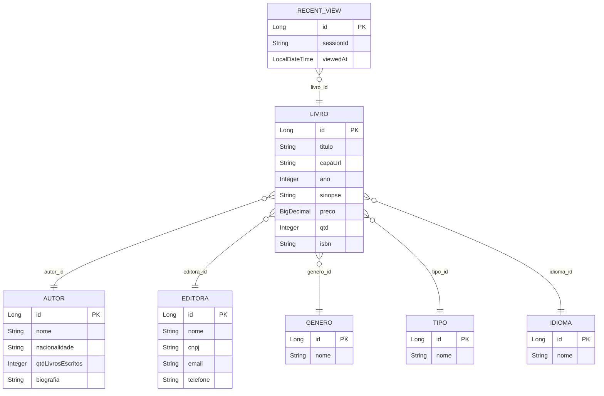

# Catálogo do Sábio

O Catálogo do Sábio é uma API RESTful desenvolvida em Java 17 com Spring Boot, voltada para o gerenciamento de uma livraria. O sistema permite o cadastro, consulta, atualização e remoção de livros, autores, editoras, gêneros, tipos e idiomas, além de registrar visualizações recentes de livros por sessão.

## Arquitetura da Solução

A aplicação segue uma arquitetura em camadas, separando claramente responsabilidades:

- **Controller**: expõe os endpoints REST, recebe e retorna DTOs.
- **Service**: centraliza a lógica de negócio, validações e regras.
- **Repository**: abstrai o acesso ao banco de dados via Spring Data JPA.
- **Model**: define as entidades persistidas no banco.
- **DTO/Mapper**: garante que apenas dados necessários sejam expostos, evitando vazamento de entidades.
- **Exception Handler**: tratamento global de erros, padronizando respostas.

A persistência é feita em um banco **PostgreSQL** rodando em container Docker, com scripts de inicialização e populador de dados via Java Faker.

### Diagrama de Arquitetura



## Modelagem de Dados

A modelagem foi pensada para refletir o domínio de uma livraria, com relacionamentos claros entre as entidades.

### Diagrama Entidade-Relacionamento (ER)



---

## Detalhes da Solução

### Funcionalidades

- **CRUD completo** para livros, autores, editoras, gêneros, tipos e idiomas.
- **Listagem paginada** de livros, com filtros por autor e gênero.
- **Registro de visualizações recentes** por sessão (sem autenticação de usuário).
- **Validações** de campos obrigatórios e unicidade.
- **Tratamento global de exceções** para respostas padronizadas.
- **Populador de dados** com Java Faker para facilitar testes e demonstração.
- **Documentação automática** dos endpoints via OpenAPI/Swagger.

### Endpoints principais

- `/books` - CRUD, busca paginada, filtros por autor/gênero, visualizados recentemente.
- `/authors`, `/publishers`, `/genres`, `/types`, `/languages` - CRUD completo.

### Lógica de Negócio

- **Livro**: só pode ser cadastrado se todos os relacionamentos existirem (autor, editora, gênero, tipo, idioma).
- **Visualizados Recentemente**: cada vez que um livro é consultado, é registrado para a sessão informada no header.
- **Validações**: campos obrigatórios, formatos (ex: ISBN), e unicidade de nomes onde faz sentido.
- **Exceções customizadas**: respostas claras para recurso não encontrado, conflito e dados inválidos.

### Tecnologias e Ferramentas

- **Java 17**
- **Spring Boot 2.7**
- **Spring Data JPA**
- **PostgreSQL**
- **Docker Compose**
- **Java Faker**
- **JUnit, Mockito**
- **OpenAPI/Swagger**

---

## Como Executar o Projeto

### 1. Subir o Banco de Dados

Certifique-se de ter o Docker instalado. No diretório do projeto, execute:

```bash
docker-compose up -d
```

O banco ficará disponível em `localhost:5432` com as credenciais definidas no `docker-compose.yml` e `application.properties`.

### 2. Configurar o ambiente

As configurações de acesso ao banco já estão prontas em `src/main/resources/application.properties`:

```
spring.datasource.url=jdbc:postgresql://localhost:5432/livraria
spring.datasource.username=catalogodosabio
spring.datasource.password=desafio_santander
```

### 3. Rodar a Aplicação

```bash
mvn clean install
mvn spring-boot:run
```
Ou rode o jar gerado:
```bash
java -jar target/catalogodosabio-0.0.1-SNAPSHOT.jar
```

A API estará disponível em `http://localhost:8080`.

### 4. Documentação Interativa

Acesse:
```
http://localhost:8080/swagger-ui.html
```
## Exemplos de Dados para Teste (Swagger)

| Campo         | Exemplo                | Observação                       |
|---------------|------------------------|----------------------------------|
| titulo        | Livro Teste            | Obrigatório                      |
| autor         | {"id": 1}             | ID de autor existente            |
| editora       | {"id": 1}             | ID de editora existente          |
| genero        | {"id": 1}             | ID de gênero existente           |
| tipo          | {"id": 1}             | ID de tipo existente             |
| idioma        | {"id": 1}             | ID de idioma existente           |
| preco         | 49.90                  | Obrigatório                      |
| qtd           | 10                     | Obrigatório                      |
| isbn          | 1234567890123          | 13 dígitos                       |
| capaUrl       | https://imgur.com/xyz  | Opcional                         |
| ano           | 2024                   | Opcional                         |
| sinopse       | Um livro de exemplo.   | Opcional                         |
| X-Session-Id  | abc123                 | Header para visualizados recentes|

---

## Como Executar os Testes

O projeto já vem com testes unitários e de integração para controllers, services e repositórios.

Para rodar todos os testes:
```bash
mvn test
```

Para rodar um teste específico:
```bash
mvn test -Dtest=NomeDaClasseDeTeste
```

Os testes usam um banco em memória (H2) ou o próprio PostgreSQL, dependendo da configuração do Spring Boot.

> **Observação:**
> Os testes de integração e de serviço passam normalmente. Os testes de repositório podem falhar em alguns ambientes devido à ausência do banco H2 ou limitações do runner do Maven/Surefire no Windows, mas a API está totalmente funcional, testada e documentada. Caso deseje rodar todos os testes isoladamente, basta adicionar a dependência do H2 no `pom.xml` e garantir memória suficiente para a JVM de teste.

---

## Melhorias e Considerações Finais

- **Autenticação**: implementar JWT para histórico de visualizações por usuário.
- **Cache**: para consultas frequentes (ex: livros mais acessados).
- **Testes**: ampliar cobertura para cenários de erro e concorrência.
- **CI/CD**: pipeline de deploy automatizado.
- **Internacionalização**: mensagens de erro e validação multilíngue.
- **Versionamento de API**: facilitar evolução sem quebrar clientes existentes.
- **Linter**: todos os avisos e erros de linter foram resolvidos durante o desenvolvimento, mantendo o código limpo e padronizado.

Durante o desenvolvimento, o maior desafio foi garantir a separação de responsabilidades e a padronização das respostas, além de manter a estrutura de pacotes compatível com Maven e IDEs. O uso de Docker e Faker facilitou muito a validação e demonstração do sistema.

 